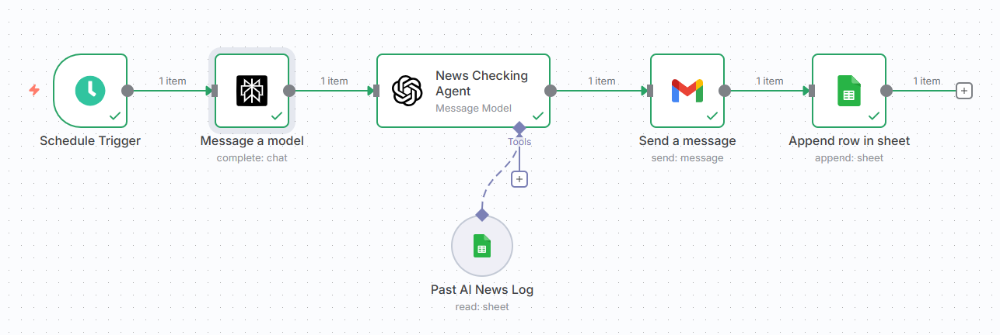
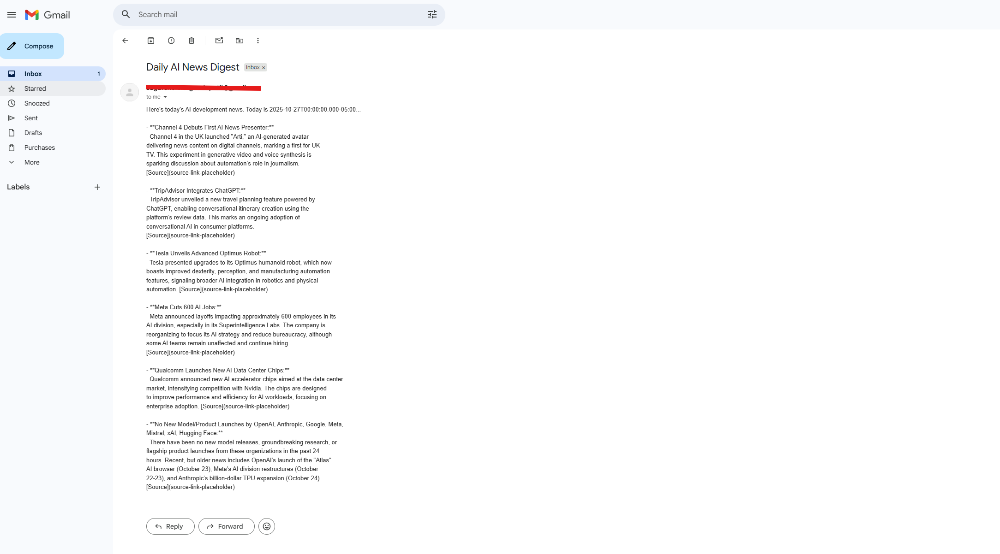

# 🤖 Daily AI News Research Agent

An **autonomous n8n workflow** that curates the latest AI development news every morning — combining **Perplexity**, **OpenAI GPT-4o**, **Google Sheets**, and **Gmail** into one smart research assistant.

---

## 🌟 Features

- 🕘 **Automated Schedule:** Runs every morning at 9 AM (customizable)  
- 🔍 **AI-Powered Research:** Uses **Perplexity** to fetch AI model releases & research updates  
- 🧠 **Smart Filtering:** Uses **GPT-4o** to clean, summarize, and remove duplicates based on your past log  
- 📊 **Persistent Memory:** Maintains a **Google Sheet** (“Past AI News Log”) to track old headlines  
- ✉️ **Email Digest:** Sends you a clean, formatted daily summary via Gmail  
- ⚡ **Zero Maintenance:** Fully automated — just set up once and enjoy daily AI updates  

---

## 🧩 Workflow Overview

### High-Level Flow
```
[Schedule Trigger @ 9AM]
   ↓
[Fetch News from Perplexity]
   ↓
[Check & Clean via GPT-4o]
   ↓
[Compare with Google Sheet Log]
   ↓
[Email Daily Digest]
   ↓
[Append New Entries to Log Sheet]
```

### Components Used

| Tool | Purpose |
|------|----------|
| 🧠 **Perplexity Node** | Gathers the latest AI headlines |
| 💬 **OpenAI GPT-4o Node** | Deduplicates, reformats, and summarizes |
| 📄 **Google Sheets Node** | Maintains “Past AI News Log” |
| 📧 **Gmail Node** | Sends the final digest email |
| ⏰ **Schedule Trigger** | Triggers the workflow automatically every day |

---

## ⚙️ Setup Guide

1. **Clone this repository**
   ```bash
   git clone https://github.com/<your-username>/ai-news-research-agent-n8n.git
   cd ai-news-research-agent-n8n
   ```

2. **Import the workflow into n8n**
   - Open your [n8n](https://n8n.io/) dashboard  
   - Click **Import > From File**  
   - Select: `workflow/daily_ai_news_research_agent.json`

3. **Configure required credentials**
   - 🧠 Perplexity API Key  
   - 💬 OpenAI API Key (you can use Azure Open AI)  
   - 📄 Google Sheets OAuth 2.0 Connection  
   - 📧 Gmail OAuth 2.0 Connection  

4. **Edit the Google Sheet reference**
   - Create a Google Sheet titled **Past AI News Log**  
   - Add two columns: `Date` and `Headlines`  
   - Paste the Sheet ID in the workflow nodes (`Google Sheets Tool` and `Append Row`)  

5. **Customize**
   - Change trigger time or email recipient  
   - Update system prompt in the GPT-4o node if you want a different tone (formal, friendly, etc.)  

---

## 🧠 Example Output
```
Here's today's AI development news. Today is October 27, 2025 ...

• **OpenAI** releases an improved GPT-4o-mini model with reduced latency.  
  Source: https://openai.com/blog/gpt-4o-mini-update

• **Anthropic** introduces a context-window expansion for Claude 3.  
  Source: https://www.anthropic.com/claude-3-update

• **Meta AI** unveils a new multi-modal model integrating text, vision, and audio.  
  Source: https://ai.meta.com/blog
```

---

## 🖼️ Screenshots

| Workflow View | Email Output |
|:--------------:|:-------------:|
|  |  |

---

## 🧭 Future Enhancements

- 🧾 Add a summarization history dashboard (Google Data Studio)  
- 🧑‍💼 Post daily updates to Slack / Microsoft Teams / Discord  
- 📬 Send weekly “Top AI News Summary”  
- 🧠 Integrate embeddings to detect semantic duplicates  

---

## 🧰 Tech Stack

- [n8n](https://n8n.io/) (No-code Automation Platform)  
- [OpenAI GPT-4o](https://platform.openai.com/docs/)  
- [Perplexity API](https://docs.perplexity.ai/)  
- [Google Sheets API](https://developers.google.com/sheets)  
- [Gmail API](https://developers.google.com/gmail)

---

