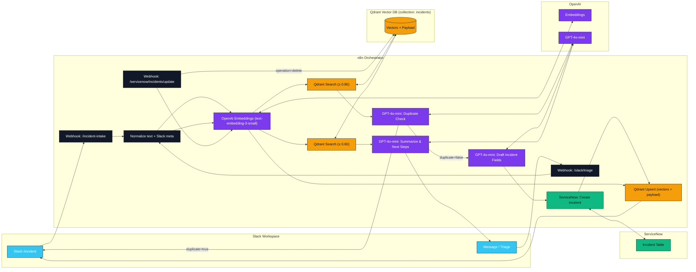
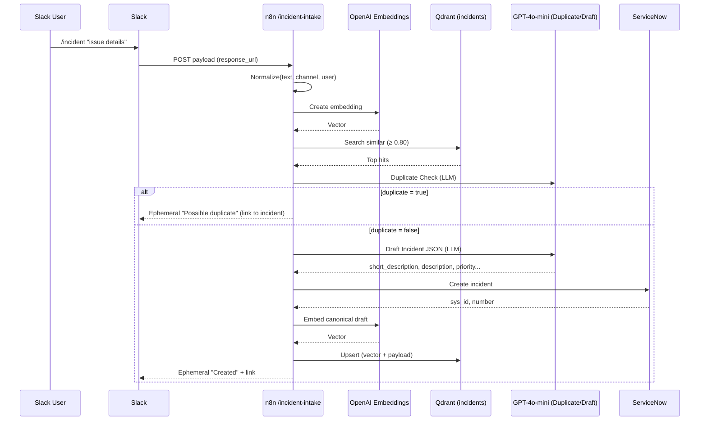
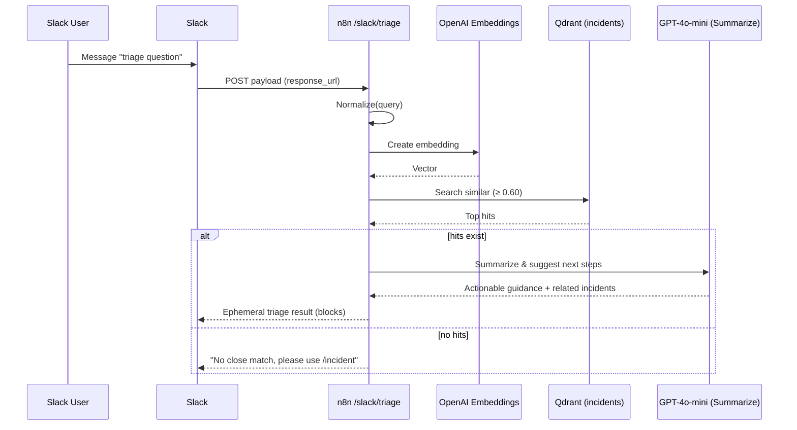

# ServiceNow + Slack AI Copilot — Architecture

> High-level architecture and request lifecycles for **Smart Intake**, **AI Triage**, and **Realtime Sync**.  
> Tech: **Slack**, **n8n**, **OpenAI**, **Qdrant**, **ServiceNow**

---

## 1) System Architecture (High-Level)


*Notes:*  
- **Smart Intake:** Qdrant similarity threshold **0.80** before incident creation.  
- **AI Triage:** Qdrant similarity threshold **0.60** for contextual answers.  
- **Realtime Sync:** SN event → re-embed & upsert, or delete from Qdrant.

---

## 2) Smart Intake — Sequence



---

## 3) AI Triage — Sequence



---

## 4) Realtime Sync — Data View

**Event:** ServiceNow incident change or delete → `POST /servicenow/incidents/update`  
- **Delete:** remove the point from **Qdrant**.  
- **Change:** rebuild canonical text → re-embed → upsert vector + payload.

---

### Embed in README
```markdown
[View Architecture](docs/ARCHITECTURE.md)
```
